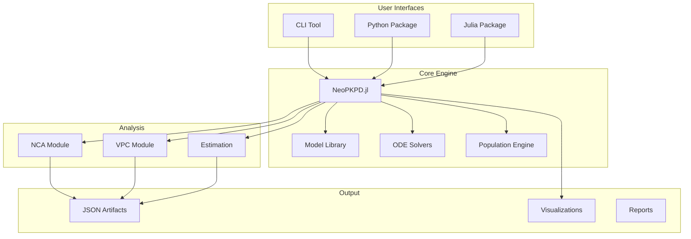

# NeoPKPD Documentation

**NeoPKPD** is a transparent, validated pharmacokinetics and pharmacodynamics (PK/PD) modeling infrastructure built for reproducibility and scientific rigor.

<div class="grid cards" markdown>

-   :material-flask:{ .lg .middle } **Comprehensive Models**

    ---

    20+ PK/PD models including one/two/three-compartment, TMDD, indirect response, and disease progression

-   :material-chart-line:{ .lg .middle } **Population Modeling**

    ---

    Full IIV/IOV support with covariate effects and residual error models

-   :material-test-tube:{ .lg .middle } **Clinical Trial Simulation**

    ---

    Parallel, crossover, dose escalation designs with power analysis

-   :material-check-decagram:{ .lg .middle } **Validated & Reproducible**

    ---

    Deterministic golden artifacts with automated validation pipelines

</div>

---

## Key Features

### Multi-Language Support

NeoPKPD provides native implementations in both **Julia** (high-performance core) and **Python** (data science integration):

=== "Python"

    ```python
    import neopkpd

    neopkpd.init_julia()

    result = neopkpd.simulate_pk_oral_first_order(
        ka=1.5, cl=5.0, v=50.0,
        doses=[{"time": 0.0, "amount": 100.0}],
        t0=0.0, t1=24.0,
        saveat=[0.0, 0.5, 1.0, 2.0, 4.0, 8.0, 12.0, 24.0]
    )

    print(f"Cmax: {max(result['observations']['conc']):.2f} mg/L")
    ```

=== "Julia"

    ```julia
    using NeoPKPD

    params = OneCompOralParams(1.5, 5.0, 50.0)  # Ka, CL, V
    doses = [DoseEvent(0.0, 100.0)]
    spec = ModelSpec(OneCompOral(), "example", params, doses)

    grid = SimGrid(0.0, 24.0, collect(0.0:0.5:24.0))
    solver = SolverSpec(:Tsit5, 1e-10, 1e-12, 10_000_000)

    result = simulate(spec, grid, solver)
    println("Cmax: $(maximum(result.conc)) mg/L")
    ```

=== "CLI"

    ```bash
    neopkpd simulate \
      --model onecomp-oral \
      --params ka=1.5,cl=5.0,v=50.0 \
      --dose "time=0,amount=100" \
      --tspan 0,24 \
      --output result.json
    ```

### Comprehensive Model Library

| Category | Models |
|----------|--------|
| **PK Models** | One/Two/Three-compartment IV & Oral, Transit absorption, Michaelis-Menten, TMDD, Parallel absorption, Enterohepatic recirculation, Autoinduction |
| **PD Models** | Direct Emax, Sigmoid Emax, Effect compartment, Indirect response (IRM 1-4), Transit PD, Disease progression, Tolerance |
| **Population** | IIV (log-normal), IOV, Power/Linear/Exponential covariates, Additive/Proportional/Combined residual error |
| **Analysis** | NCA (AUC, Cmax, t1/2, etc.), VPC (standard, pcVPC, stratified), Parameter estimation (FOCE, SAEM, Laplacian) |

### Reproducibility First

Every simulation produces deterministic, versioned artifacts:

```json
{
  "metadata": {
    "schema_version": "1.0.0",
    "event_semantics_version": "1.0.0",
    "solver_semantics_version": "1.0.0",
    "timestamp": "2024-01-15T10:30:00Z",
    "git_sha": "abc123..."
  },
  "model": "OneCompOral",
  "parameters": {"Ka": 1.5, "CL": 5.0, "V": 50.0},
  "results": {...}
}
```

---

## Quick Start

### Installation

=== "Python"

    ```bash
    pip install neopkpd
    ```

=== "Julia"

    ```julia
    using Pkg
    Pkg.add("NeoPKPD")
    ```

=== "CLI"

    ```bash
    # After Python installation
    pip install neopkpd

    # Verify installation
    neopkpd --version
    ```

### Your First Simulation

=== "Python"

    ```python
    import neopkpd
    from neopkpd import viz

    # Initialize Julia backend
    neopkpd.init_julia()

    # Simulate one-compartment oral PK
    result = neopkpd.simulate_pk_oral_first_order(
        ka=1.5,      # Absorption rate constant (1/hr)
        cl=5.0,      # Clearance (L/hr)
        v=50.0,      # Volume of distribution (L)
        doses=[{"time": 0.0, "amount": 100.0}],
        t0=0.0,
        t1=24.0,
        saveat=[0.0, 0.5, 1.0, 2.0, 4.0, 8.0, 12.0, 24.0]
    )

    # Access results
    print(f"Time points: {len(result['times'])}")
    print(f"Cmax: {max(result['observations']['conc']):.2f} mg/L")

    # Visualize
    viz.set_backend("matplotlib")
    fig = viz.plot_conc_time(result, title="PK Profile")
    fig.savefig("pk_profile.png", dpi=300)
    ```

=== "Julia"

    ```julia
    using NeoPKPD

    # Define model parameters
    params = OneCompOralParams(
        Ka = 1.5,    # Absorption rate constant (1/hr)
        CL = 5.0,    # Clearance (L/hr)
        V = 50.0     # Volume of distribution (L)
    )

    # Define dosing
    doses = [DoseEvent(0.0, 100.0)]

    # Create model specification
    spec = ModelSpec(OneCompOral(), "first_sim", params, doses)

    # Simulation settings
    grid = SimGrid(0.0, 24.0, collect(0.0:0.5:24.0))
    solver = SolverSpec(:Tsit5, 1e-10, 1e-12, 10_000_000)

    # Run simulation
    result = simulate(spec, grid, solver)

    # Access results
    println("Time points: $(length(result.times))")
    println("Cmax: $(maximum(result.conc)) mg/L")
    ```

### Population Simulation

=== "Python"

    ```python
    # Simulate 100 subjects with inter-individual variability
    pop_result = neopkpd.simulate_population_oral(
        ka=1.5, cl=5.0, v=50.0,
        doses=[{"time": 0.0, "amount": 100.0}],
        t0=0.0, t1=24.0, saveat=0.5,
        n=100,
        omegas={"Ka": 0.16, "CL": 0.09, "V": 0.04},  # ~40%, 30%, 20% CV
        seed=42
    )

    # Population summary
    print(f"Subjects: {pop_result['n_subjects']}")
    print(f"Median Cmax: {max(pop_result['median']):.2f} mg/L")
    ```

=== "Julia"

    ```julia
    # Define omega matrix (IIV)
    omega = OmegaMatrix([
        0.16 0.0  0.0;   # Ka: ~40% CV
        0.0  0.09 0.0;   # CL: ~30% CV
        0.0  0.0  0.04   # V:  ~20% CV
    ])

    # Population specification
    pop_spec = PopulationSpec(
        spec,
        n = 100,
        omega = omega,
        seed = 42
    )

    # Simulate population
    pop_result = simulate_population(pop_spec, grid, solver)

    # Access summaries
    println("Subjects: $(length(pop_result.individuals))")
    println("Median Cmax: $(maximum(pop_result.summaries[:conc].median)) mg/L")
    ```

### Non-Compartmental Analysis

=== "Python"

    ```python
    # Run NCA on concentration-time data
    nca_result = neopkpd.run_nca(
        times=[0, 0.5, 1, 2, 4, 8, 12, 24],
        concentrations=[0, 5.2, 8.1, 6.3, 3.8, 1.9, 0.9, 0.2],
        dose=100.0,
        route="oral"
    )

    print(f"AUC0-inf: {nca_result['auc_inf']:.1f} mg*hr/L")
    print(f"Cmax: {nca_result['cmax']:.2f} mg/L")
    print(f"Tmax: {nca_result['tmax']:.1f} hr")
    print(f"t1/2: {nca_result['half_life']:.1f} hr")
    ```

=== "Julia"

    ```julia
    # NCA analysis
    nca_result = run_nca(
        times = [0, 0.5, 1, 2, 4, 8, 12, 24],
        concentrations = [0, 5.2, 8.1, 6.3, 3.8, 1.9, 0.9, 0.2],
        dose = 100.0,
        route = :oral
    )

    println("AUC0-inf: $(nca_result.auc_inf) mg*hr/L")
    println("Cmax: $(nca_result.cmax) mg/L")
    println("Tmax: $(nca_result.tmax) hr")
    println("t1/2: $(nca_result.half_life) hr")
    ```

---

## Core Concepts

### Pharmacokinetic Models

NeoPKPD implements standard PK models with validated ODE solvers:

| Model | Compartments | Routes | Key Parameters |
|-------|--------------|--------|----------------|
| One-Compartment | 1 | IV, Oral | CL, V, (Ka) |
| Two-Compartment | 2 | IV, Oral | CL, V1, Q, V2, (Ka) |
| Three-Compartment | 3 | IV | CL, V1, Q2, V2, Q3, V3 |
| Michaelis-Menten | 1 | IV | Vmax, Km, V |
| TMDD | 2-3 | IV | kon, koff, kint, Rtot |

[:octicons-arrow-right-24: PK Models (Julia)](julia/models/index.md) | [:octicons-arrow-right-24: PK Models (Python)](python/models/index.md)

### Pharmacodynamic Models

Direct and indirect response models for drug effects:

| Model | Type | Equation |
|-------|------|----------|
| Direct Emax | Immediate | $E = E_0 + \frac{E_{max} \cdot C}{EC_{50} + C}$ |
| Sigmoid Emax | Immediate | $E = E_0 + \frac{E_{max} \cdot C^n}{EC_{50}^n + C^n}$ |
| Effect Compartment | Delayed | $\frac{dC_e}{dt} = k_{e0}(C_p - C_e)$ |
| Indirect Response | Turnover | $\frac{dR}{dt} = k_{in} \cdot (1 \pm \text{Drug}) - k_{out} \cdot R$ |

[:octicons-arrow-right-24: PD Models (Julia)](julia/models/index.md) | [:octicons-arrow-right-24: PD Models (Python)](python/models/index.md)

### Population Modeling

Account for variability between and within individuals:

- **Inter-Individual Variability (IIV)**: $\theta_i = \theta_{pop} \cdot e^{\eta_i}$, where $\eta_i \sim N(0, \omega^2)$
- **Inter-Occasion Variability (IOV)**: $\theta_{ij} = \theta_i \cdot e^{\kappa_{ij}}$
- **Covariate Effects**: Power, linear, exponential relationships
- **Residual Error**: Additive, proportional, combined models

[:octicons-arrow-right-24: Population (Julia)](julia/population/index.md) | [:octicons-arrow-right-24: Population (Python)](python/population/index.md)

### Visual Predictive Check (VPC)

Model validation through simulation-based diagnostics:

- **Standard VPC**: Compare observed vs simulated percentiles
- **Prediction-Corrected VPC**: Normalize for variable dosing
- **Stratified VPC**: Separate analysis by covariate groups
- **BLQ Handling**: Multiple methods for below-quantification data

[:octicons-arrow-right-24: VPC (Julia)](julia/vpc/index.md) | [:octicons-arrow-right-24: VPC (Python)](python/vpc/index.md)

### Clinical Trial Simulation

Design and analyze virtual clinical trials:

- **Parallel Designs**: Standard two-arm comparisons
- **Crossover Designs**: 2x2, 3x3, replicate designs
- **Dose Escalation**: 3+3, mTPI, CRM, BOIN algorithms
- **Power Analysis**: Sample size calculation, BE studies

[:octicons-arrow-right-24: Trials (Julia)](julia/trial/index.md) | [:octicons-arrow-right-24: Trials (Python)](python/trial/index.md)

### Parameter Estimation

Fit models to observed data:

- **FOCE-I**: First-Order Conditional Estimation with Interaction
- **SAEM**: Stochastic Approximation Expectation Maximization
- **Laplacian**: Laplacian approximation method
- **Bootstrap**: Uncertainty quantification

[:octicons-arrow-right-24: Estimation (Julia)](julia/estimation/index.md) | [:octicons-arrow-right-24: Estimation (Python)](python/estimation/index.md)

### Visualization

Publication-quality plots with dual backend support:

```python
from neopkpd import viz

# Set backend: matplotlib (static) or plotly (interactive)
viz.set_backend("matplotlib")

# 55+ visualization functions
viz.plot_conc_time(result)           # PK profiles
viz.plot_vpc(vpc_result)             # VPC plots
viz.plot_goodness_of_fit(est_result) # GOF diagnostics
viz.plot_forest(forest_data)         # Forest plots
```

[:octicons-arrow-right-24: Visualization](python/viz/index.md)

---

## Documentation Contents

<div class="grid cards" markdown>

-   :material-language-julia:{ .lg .middle } **Julia Documentation**

    ---

    High-performance core library with full model implementations

    [:octicons-arrow-right-24: Julia Docs](julia/index.md)

-   :material-language-python:{ .lg .middle } **Python Documentation**

    ---

    Data science integration with visualization and analysis tools

    [:octicons-arrow-right-24: Python Docs](python/index.md)

-   :material-play-box:{ .lg .middle } **Examples**

    ---

    Working examples for all major features and use cases

    [:octicons-arrow-right-24: Examples](examples/README.md)

-   :material-book-open:{ .lg .middle } **Concepts**

    ---

    Architecture, semantics, and reproducibility principles

    [:octicons-arrow-right-24: Concepts](architecture.md)

</div>

### By Topic

| Topic | Julia | Python |
|-------|-------|--------|
| **PK Models** | [Models](julia/models/index.md) | [Models](python/models/index.md) |
| **Population** | [Population](julia/population/index.md) | [Population](python/population/index.md) |
| **NCA** | [NCA](julia/nca/index.md) | [NCA](python/nca/index.md) |
| **Estimation** | [Estimation](julia/estimation/index.md) | [Estimation](python/estimation/index.md) |
| **VPC** | [VPC](julia/vpc/index.md) | [VPC](python/vpc/index.md) |
| **Clinical Trials** | [Trials](julia/trial/index.md) | [Trials](python/trial/index.md) |
| **Data Import** | [Import](julia/import/index.md) | [Import](python/data/index.md) |
| **Visualization** | - | [Viz](python/viz/index.md) |

---

## Architecture Overview



---

## Version Information

```
NeoPKPD Version: 0.1.0
Event Semantics: 1.0.0
Solver Semantics: 1.0.0
Artifact Schema: 1.0.0
```

### Compatibility

| Component | Version | Notes |
|-----------|---------|-------|
| Julia | 1.9+ | Core engine |
| Python | 3.10+ | Python bindings |
| NumPy | 1.24+ | Array operations |
| Matplotlib | 3.7+ | Static plots |
| Plotly | 5.14+ | Interactive plots |

---

## Getting Help

- **Documentation**: You're here!
- **Examples**: [Working examples](examples/README.md) for all features
- **Issues**: [GitHub Issues](https://github.com/neopkpd/NeoPKPD/issues)
- **Discussions**: [GitHub Discussions](https://github.com/neopkpd/NeoPKPD/discussions)

---

## License

NeoPKPD is open source software released under the MIT License. See the [repository](https://github.com/neopkpd/NeoPKPD) for details.
