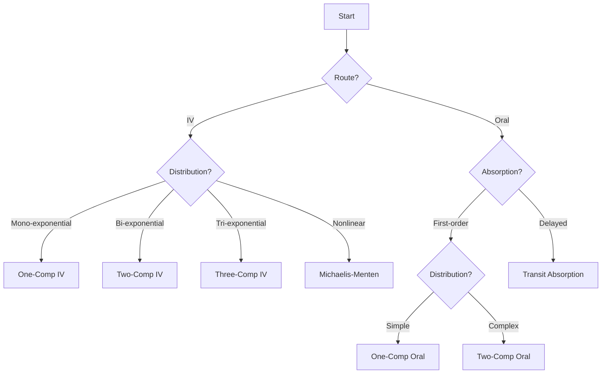
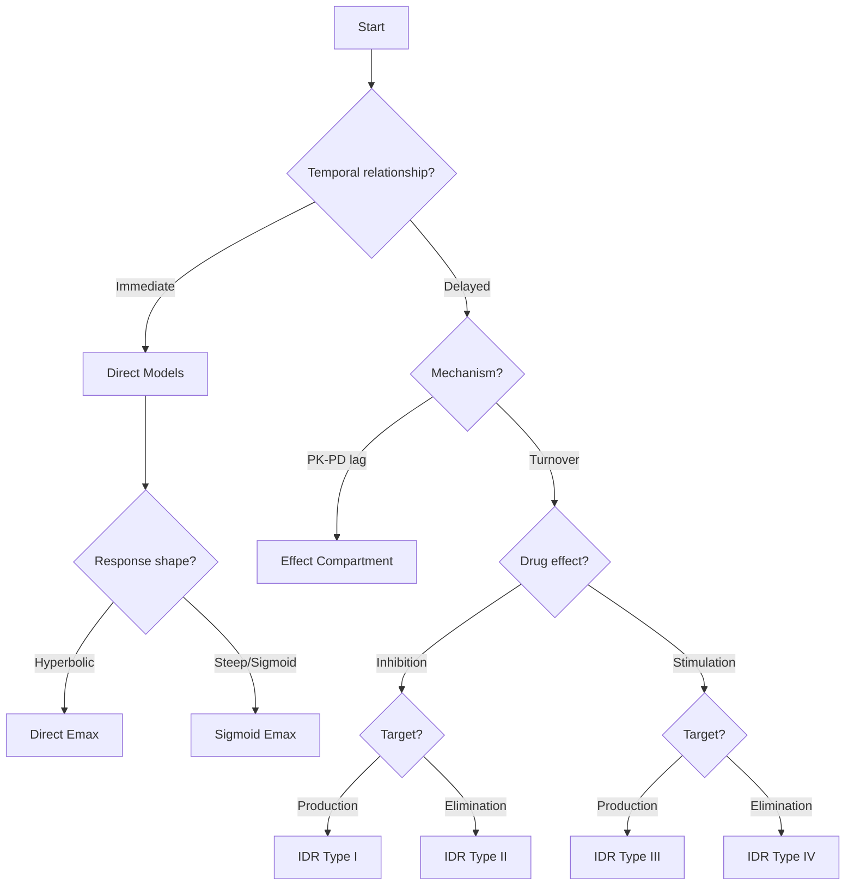

# Models Reference

NeoPKPD provides a comprehensive library of validated pharmacokinetic (PK) and pharmacodynamic (PD) models for drug concentration and effect simulation.

---

## Model Categories

<div class="grid cards" markdown>

-   :material-cube-outline:{ .lg .middle } **Pharmacokinetic Models**

    ---

    Compartmental models describing drug distribution and elimination

    [:octicons-arrow-right-24: PK Models](#pharmacokinetic-models)

-   :material-chart-line:{ .lg .middle } **Pharmacodynamic Models**

    ---

    Effect models linking concentration to response

    [:octicons-arrow-right-24: PD Models](#pharmacodynamic-models)

</div>

---

## Pharmacokinetic Models

### Compartmental PK Models

| Model | Page | Parameters | Route | Use Case |
|-------|------|------------|-------|----------|
| One-Comp IV Bolus | [→](pk/onecomp-iv-bolus.md) | CL, V | IV | Simple IV kinetics |
| One-Comp Oral | [→](pk/onecomp-oral.md) | Ka, CL, V | Oral | Simple oral drugs |
| Two-Comp IV | [→](pk/twocomp-iv.md) | CL, V1, Q, V2 | IV | Distribution kinetics |
| Two-Comp Oral | [→](pk/twocomp-oral.md) | Ka, CL, V1, Q, V2 | Oral | Oral with distribution |
| Three-Comp IV | [→](pk/threecomp-iv.md) | CL, V1, Q2, V2, Q3, V3 | IV | Deep tissue |
| Transit Absorption | [→](pk/transit-absorption.md) | N, Ktr, Ka, CL, V | Oral | Delayed absorption |
| TMDD | [→](pk/tmdd.md) | Multiple | IV | Target-mediated disposition |

### Model Selection Guide



---

## Pharmacodynamic Models

### Effect Models

| Model | Page | Parameters | Type | Mechanism |
|-------|------|------------|------|-----------|
| Direct Emax | [→](pd/direct-emax.md) | E0, Emax, EC50 | Direct | Hyperbolic response |
| Sigmoid Emax | [→](pd/sigmoid-emax.md) | E0, Emax, EC50, γ | Direct | Hill equation |
| Effect Compartment | [→](pd/effect-compartment.md) | ke0, E0, Emax, EC50 | Indirect | Biophase equilibration |
| Disease Progression | [→](pd/disease-progression.md) | Multiple | Complex | Disease dynamics |

### PD Model Selection Guide



---

## Common Features

### Dose Events

All models support flexible dosing:

```julia
# Single bolus
doses = [DoseEvent(0.0, 100.0)]

# Multiple doses
doses = [
    DoseEvent(0.0, 100.0),
    DoseEvent(12.0, 100.0),
    DoseEvent(24.0, 100.0)
]

# IV Infusion (1-hour)
doses = [DoseEvent(0.0, 100.0, 1.0)]
```

### Observation Types

| Observation | Symbol | Description |
|-------------|--------|-------------|
| Concentration | `:conc` | Drug concentration in central compartment |
| Effect | `:effect` | Pharmacodynamic effect |
| Response | `:response` | Indirect response biomarker |
| Ce | `:ce` | Effect site concentration |

### Solver Options

```julia
# Standard solver for non-stiff problems
solver = SolverSpec(:Tsit5, 1e-10, 1e-12, 10_000_000)

# For stiff problems (e.g., rapid binding)
solver = SolverSpec(:Rosenbrock23, 1e-8, 1e-10, 1_000_000)

# High accuracy for validation
solver = SolverSpec(:Vern9, 1e-14, 1e-14, 100_000_000)
```

---

## Model Implementation

### Type Hierarchy

```julia
# Abstract types
abstract type ModelKind end
abstract type AbstractParams end

# PK model kinds
struct OneCompIVBolus <: ModelKind end
struct TwoCompIVBolus <: ModelKind end
# ...

# Parameter types
struct OneCompIVBolusParams <: AbstractParams
    CL::Float64
    V::Float64
end
```

### Creating Custom Models

See the source code in `packages/core/src/models/` for examples of extending NeoPKPD with custom models.

---

## Next Steps

- [One-Comp IV Bolus](pk/onecomp-iv-bolus.md) - Start with the simplest model
- [Population Modeling](../population/index.md) - Add variability
- [Parameter Estimation](../estimation/index.md) - Fit to data
