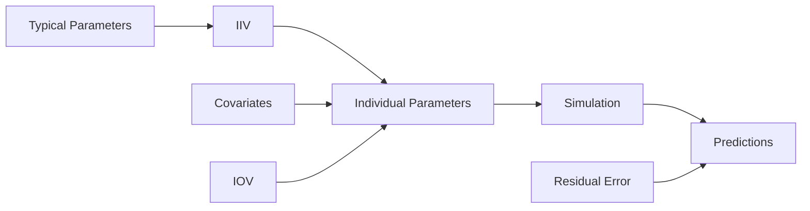

# Population Modeling

Population pharmacokinetic/pharmacodynamic (PopPK/PD) modeling accounts for variability between and within individuals, enabling more accurate predictions and personalized dosing.

---

## Overview

OpenPKPD supports comprehensive population modeling including:

- **Inter-Individual Variability (IIV)** - Parameter differences between subjects
- **Inter-Occasion Variability (IOV)** - Parameter changes within a subject over time
- **Covariate Effects** - Patient characteristics affecting parameters
- **Residual Error Models** - Unexplained variability in observations



---

## Documentation

<div class="grid cards" markdown>

-   :material-account-multiple:{ .lg .middle } **Inter-Individual Variability**

    ---

    Log-normal distribution of parameters across subjects

    [:octicons-arrow-right-24: IIV Reference](iiv.md)

-   :material-calendar-sync:{ .lg .middle } **Inter-Occasion Variability**

    ---

    Parameter variation between dosing occasions

    [:octicons-arrow-right-24: IOV Reference](iov.md)

-   :material-tune:{ .lg .middle } **Covariate Models**

    ---

    Weight, age, renal function effects

    [:octicons-arrow-right-24: Covariates](covariates.md)

-   :material-chart-bell-curve:{ .lg .middle } **Residual Error**

    ---

    Additive, proportional, combined error models

    [:octicons-arrow-right-24: Residual Error](residual-error.md)

</div>

---

## Quick Start

### Basic Population Simulation

```julia
using OpenPKPDCore

# Typical parameters
typical_params = OneCompIVBolusParams(5.0, 50.0)  # CL=5, V=50

# Omega matrix (variance of random effects)
# Diagonal: 30% CV on CL, 20% CV on V
omega = OmegaMatrix([
    0.09 0.0;   # ω²_CL
    0.0  0.04   # ω²_V
])

# Base specification
doses = [DoseEvent(0.0, 100.0)]
base_spec = ModelSpec(OneCompIVBolus(), "pop_sim", typical_params, doses)

# Population specification
pop_spec = PopulationSpec(
    base_spec,
    n = 100,           # Number of subjects
    omega = omega,
    seed = 12345       # For reproducibility
)

# Simulate
grid = SimGrid(0.0, 24.0, collect(0.0:1.0:24.0))
solver = SolverSpec(:Tsit5, 1e-10, 1e-12, 10_000_000)

result = simulate_population(pop_spec, grid, solver)

# Access results
println("Number of individuals: ", length(result.individuals))
println("Median Cmax: ", maximum(result.summaries[:conc].median))
```

### Adding Covariates

```julia
# Weight-based allometric scaling
covariate_model = CovariateModel([
    CovariateEffect(:CL, :WT, 70.0, :power, 0.75),  # CL ~ WT^0.75
    CovariateEffect(:V, :WT, 70.0, :power, 1.0)     # V ~ WT^1.0
])

# Generate subject weights
using Random
Random.seed!(42)
weights = 50.0 .+ 40.0 .* rand(100)  # 50-90 kg
covariates = [Dict(:WT => w) for w in weights]

# Population with covariates
pop_spec = PopulationSpec(
    base_spec,
    n = 100,
    omega = omega,
    seed = 12345,
    covariate_model = covariate_model,
    covariates = covariates
)

result = simulate_population(pop_spec, grid, solver)
```

---

## Key Concepts

### Random Effects

Individual parameters are derived from typical values and random effects:

$$P_i = \theta \cdot e^{\eta_i}$$

Where:
- $P_i$ = Individual parameter
- $\theta$ = Typical (population) value
- $\eta_i$ = Random effect, $\eta_i \sim N(0, \omega^2)$

### Omega Matrix

The omega matrix defines the variance-covariance of random effects:

```julia
# Diagonal (independent parameters)
omega = OmegaMatrix([
    0.09 0.0;
    0.0  0.04
])

# Full (correlated parameters)
omega = OmegaMatrix([
    0.09 0.03;   # Correlation between CL and V
    0.03 0.04
])
```

### Coefficient of Variation

For log-normal distribution, the relationship between omega and CV is:

$$CV = \sqrt{e^{\omega^2} - 1} \approx \omega \text{ (for small ω)}$$

| ω² | ω | Approximate CV |
|----|---|----------------|
| 0.04 | 0.20 | 20% |
| 0.09 | 0.30 | 30% |
| 0.16 | 0.40 | 42% |
| 0.25 | 0.50 | 53% |

---

## Population Result Structure

```julia
struct PopulationResult
    individuals::Vector{SimResult}        # Individual simulation results
    realized_params::Vector{Dict}         # Realized parameter values
    etas::Matrix{Float64}                 # Random effects (n × p)
    summaries::Dict{Symbol, Summary}      # Population summary statistics
    metadata::Dict                        # Additional information
end

struct Summary
    mean::Vector{Float64}
    median::Vector{Float64}
    sd::Vector{Float64}
    quantiles::Dict{Float64, Vector{Float64}}
end
```

---

## Summary Statistics

```julia
# Access population summaries
summary = result.summaries[:conc]

# Central tendency
summary.mean      # Mean concentration at each time
summary.median    # Median concentration

# Variability
summary.sd        # Standard deviation

# Percentiles
summary.quantiles[0.05]   # 5th percentile
summary.quantiles[0.25]   # 25th percentile
summary.quantiles[0.50]   # Median
summary.quantiles[0.75]   # 75th percentile
summary.quantiles[0.95]   # 95th percentile
```

---

## Next Steps

- [IIV Details](iiv.md) - Understanding inter-individual variability
- [Covariate Modeling](covariates.md) - Adding patient characteristics
- [Parameter Estimation](../estimation/index.md) - Fitting population models
- [VPC](../vpc/index.md) - Visual predictive checks for validation
