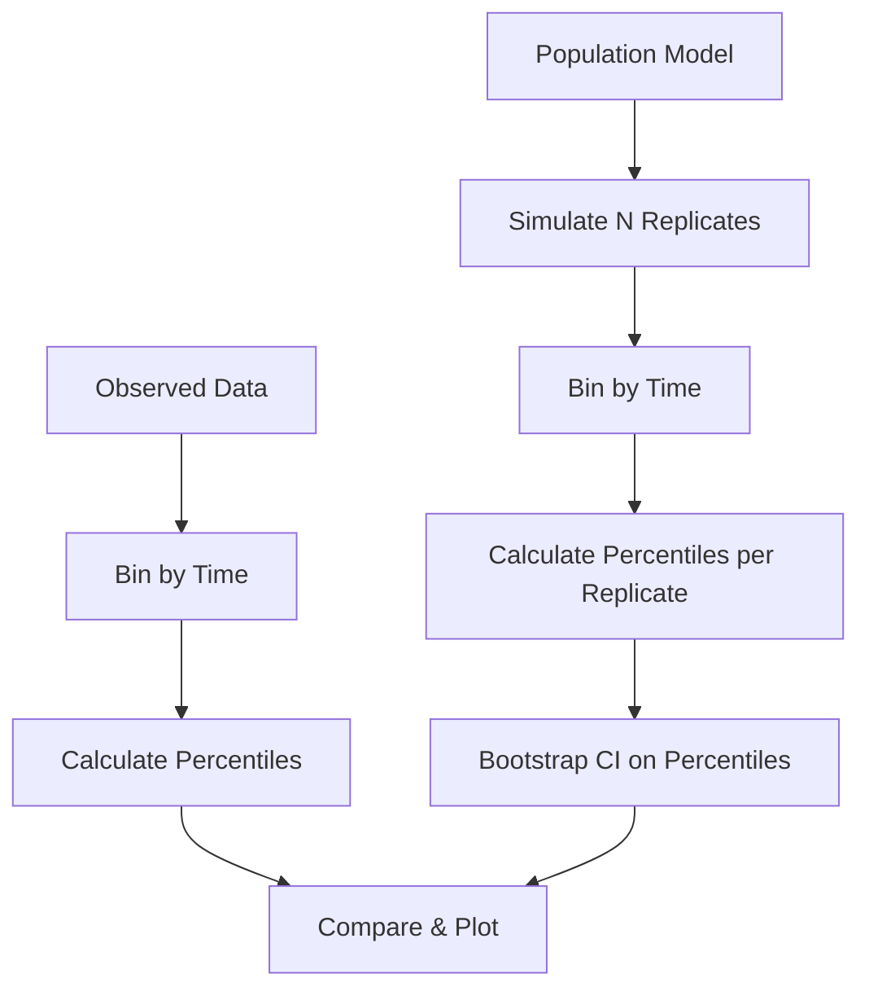

# Standard VPC

Comprehensive guide to standard Visual Predictive Checks for model validation.

---

## Overview

Standard VPC compares observed data percentiles to simulated percentile distributions within time bins. It's the foundational diagnostic tool for assessing whether a population model adequately captures the central tendency and variability of observed data.

$$\text{VPC validates: } P_{obs}(q) \in CI_{sim}(q) \text{ for each percentile } q$$



---

## VPCConfig

The `VPCConfig` struct controls all VPC behavior:

```julia
struct VPCConfig
    pi_levels::Vector{Float64}       # Prediction interval levels
    ci_level::Float64                # Confidence interval level
    binning::BinningStrategy         # Binning method
    prediction_corrected::Bool       # Enable pcVPC
    stratify_by::Vector{Symbol}      # Stratification variables
    lloq::Union{Nothing,Float64}     # Lower limit of quantitation
    n_simulations::Int               # Number of simulation replicates
    n_bootstrap::Int                 # Bootstrap samples for CI
    seed::UInt64                     # Random seed
end
```

### Default Configuration

```julia
config = VPCConfig()
# Defaults:
#   pi_levels = [0.05, 0.50, 0.95]
#   ci_level = 0.95
#   binning = QuantileBinning(10)
#   prediction_corrected = false
#   stratify_by = Symbol[]
#   lloq = nothing
#   n_simulations = 200
#   n_bootstrap = 500
#   seed = 12345
```

### Custom Configuration

```julia
config = VPCConfig(
    pi_levels = [0.10, 0.50, 0.90],     # 10th, 50th, 90th percentiles
    ci_level = 0.90,                     # 90% CI
    binning = QuantileBinning(8),        # 8 bins with equal obs
    n_simulations = 500,                 # More simulations
    n_bootstrap = 1000,                  # More bootstrap samples
    seed = 42                            # Reproducible
)
```

---

## Binning Strategies

Binning groups observations by time for percentile calculation.

### QuantileBinning (Default)

Creates bins with approximately equal numbers of observations:

```julia
using OpenPKPDCore

# 10 bins with equal observation counts
binning = QuantileBinning(10)

# Specify number of bins
config = VPCConfig(binning = QuantileBinning(8))
```

**Best for:** Sparse or uneven sampling designs.

### EqualWidthBinning

Creates bins with equal time ranges:

```julia
# 10 bins with equal time width
binning = EqualWidthBinning(10)

config = VPCConfig(binning = EqualWidthBinning(12))
```

**Best for:** Dense, uniformly sampled data.

### KMeansBinning

Uses k-means clustering to find natural time groupings:

```julia
# K-means with 8 clusters
binning = KMeansBinning(8)

# With custom max iterations
binning = KMeansBinning(8, max_iter=200)

config = VPCConfig(binning = KMeansBinning(10))
```

**Best for:** Data with natural time clusters (e.g., sparse PK sampling).

### Binning Comparison

| Strategy | Description | Advantages | Disadvantages |
|----------|-------------|------------|---------------|
| Quantile | Equal obs per bin | Stable percentiles | Uneven time coverage |
| EqualWidth | Equal time ranges | Even time coverage | Variable precision |
| KMeans | Natural clusters | Adaptive | May find unintuitive bins |

---

## Computing Standard VPC

### Basic Usage

```julia
using OpenPKPDCore

# Define observed data structure
observed = ObservedData(
    subject_ids = ["S1", "S1", "S2", "S2", ...],
    times = [0.5, 2.0, 0.5, 2.0, ...],
    dv = [10.5, 5.2, 12.1, 6.8, ...],
    dvid = fill(:conc, length(times))
)

# Population specification (final model)
typical_params = OneCompOralParams(1.5, 5.0, 50.0)  # Ka, CL, V
omega = OmegaMatrix([
    0.09 0.0  0.0;
    0.0  0.09 0.0;
    0.0  0.0  0.04
])

doses = [DoseEvent(0.0, 100.0)]
base_spec = ModelSpec(OneCompOral(), "vpc_model", typical_params, doses)

pop_spec = PopulationSpec(
    base_spec,
    n = length(unique(observed.subject_ids)),
    omega = omega,
    seed = 12345
)

# Simulation grid matching observed times
grid = SimGrid(0.0, 24.0, collect(0.0:0.5:24.0))
solver = SolverSpec(:Tsit5, 1e-10, 1e-12, 10_000_000)

# VPC configuration
config = VPCConfig(
    pi_levels = [0.05, 0.50, 0.95],
    n_simulations = 500,
    binning = QuantileBinning(8),
    seed = 42
)

# Compute VPC
result = compute_vpc(observed, pop_spec, grid, solver; config=config)
```

### With Residual Error

```julia
# Add residual error model
error_spec = ResidualErrorSpec(
    kind = :combined,
    sigma_add = 0.1,
    sigma_prop = 0.1
)

result = compute_vpc(
    observed, pop_spec, grid, solver;
    config = config,
    error_spec = error_spec
)
```

---

## VPCResult Structure

```julia
struct VPCResult
    config::VPCConfig                    # Configuration used
    bins::Vector{VPCBin}                 # Computed bins
    n_subjects_observed::Int             # Number of subjects
    n_observations_observed::Int         # Total observations
    n_simulations::Int                   # Simulations performed
    strata::String                       # Strata label
    simulation_seed::UInt64              # Seed used
end

struct VPCBin
    bin_id::Int                          # Bin identifier
    time_min::Float64                    # Lower time bound
    time_max::Float64                    # Upper time bound
    time_midpoint::Float64               # Midpoint for plotting
    n_observed::Int                      # Observations in bin
    n_simulated::Int                     # Simulated per replicate
    percentiles::Vector{VPCPercentileData}
end

struct VPCPercentileData
    percentile::Float64                  # Percentile level (e.g., 0.50)
    observed::Float64                    # Observed percentile value
    simulated_median::Float64            # Median of simulated percentiles
    simulated_lower::Float64             # Lower CI bound
    simulated_upper::Float64             # Upper CI bound
end
```

---

## Accessing Results

### Bin Information

```julia
# Get all bin midpoints for plotting
times = bin_midpoints(result)
println("Bin midpoints: ", times)

# Access individual bins
for bin in result.bins
    println("Bin $(bin.bin_id): [$(bin.time_min), $(bin.time_max)]")
    println("  N observed: $(bin.n_observed)")
    println("  Midpoint: $(bin.time_midpoint)")
end
```

### Percentile Data

```julia
# Extract observed percentiles
obs_p05 = observed_percentile(result, 0.05)
obs_p50 = observed_percentile(result, 0.50)
obs_p95 = observed_percentile(result, 0.95)

# Extract simulated median percentiles
sim_p05 = simulated_median(result, 0.05)
sim_p50 = simulated_median(result, 0.50)
sim_p95 = simulated_median(result, 0.95)

# Extract simulated CI bounds
sim_p50_lower = simulated_lower(result, 0.50)
sim_p50_upper = simulated_upper(result, 0.50)
```

### Detailed Percentile Access

```julia
for bin in result.bins
    for pdata in bin.percentiles
        println("Bin $(bin.bin_id), P$(Int(pdata.percentile*100)):")
        println("  Observed: $(pdata.observed)")
        println("  Simulated median: $(pdata.simulated_median)")
        println("  Simulated 95% CI: [$(pdata.simulated_lower), $(pdata.simulated_upper)]")
    end
end
```

---

## Interpretation Guide

### Good Model Fit

A well-specified model shows:

1. **Observed percentiles within CI ribbons** for most bins
2. **No systematic trends** in deviations
3. **Similar patterns** across the time course

```
✓ Median (50th) within simulated CI
✓ 5th/95th percentiles within their CIs
✓ No consistent over/under-prediction
```

### Potential Issues

| Pattern | Interpretation | Action |
|---------|----------------|--------|
| Observed median above CI | Under-prediction | Check structural model |
| Observed 95th above CI | Under-estimated variability | Increase omega values |
| Observed 5th below CI | Over-estimated variability | Decrease omega values |
| Early deviation only | Absorption misspecification | Consider transit model |
| Late deviation only | Elimination misspecification | Check clearance model |
| All bins offset | Systematic bias | Review typical values |

### Quantitative Assessment

```julia
# Count bins where observed is within CI
function vpc_coverage(result::VPCResult, level::Float64)
    in_ci = 0
    total = length(result.bins)

    for bin in result.bins
        for pdata in bin.percentiles
            if pdata.percentile == level
                if pdata.simulated_lower <= pdata.observed <= pdata.simulated_upper
                    in_ci += 1
                end
            end
        end
    end

    return in_ci / total
end

coverage_50 = vpc_coverage(result, 0.50)
coverage_05 = vpc_coverage(result, 0.05)
coverage_95 = vpc_coverage(result, 0.95)

println("Coverage (expected ~95%):")
println("  Median: $(coverage_50 * 100)%")
println("  5th percentile: $(coverage_05 * 100)%")
println("  95th percentile: $(coverage_95 * 100)%")
```

---

## Complete Example

```julia
using OpenPKPDCore
using Random

# ================================================
# Standard VPC Example: One-Compartment Oral Model
# ================================================

println("=== Standard VPC Computation ===\n")

# 1. Generate synthetic observed data
Random.seed!(123)
n_subjects = 50
times_per_subject = [0.5, 1.0, 2.0, 4.0, 8.0, 12.0, 24.0]

subject_ids = String[]
obs_times = Float64[]
obs_dv = Float64[]

# True parameters with IIV
true_ka = 1.5
true_cl = 5.0
true_v = 50.0
omega_ka = 0.16  # 40% CV
omega_cl = 0.09  # 30% CV
omega_v = 0.04   # 20% CV

for i in 1:n_subjects
    # Individual parameters
    eta_ka = randn() * sqrt(omega_ka)
    eta_cl = randn() * sqrt(omega_cl)
    eta_v = randn() * sqrt(omega_v)

    ka_i = true_ka * exp(eta_ka)
    cl_i = true_cl * exp(eta_cl)
    v_i = true_v * exp(eta_v)

    dose = 100.0

    for t in times_per_subject
        # One-compartment oral analytical solution
        conc = dose * ka_i / (v_i * (ka_i - cl_i/v_i)) *
               (exp(-cl_i/v_i * t) - exp(-ka_i * t))

        # Add residual error (proportional 10%)
        conc_obs = conc * (1 + 0.1 * randn())
        conc_obs = max(0.01, conc_obs)  # Ensure positive

        push!(subject_ids, "S$i")
        push!(obs_times, t)
        push!(obs_dv, conc_obs)
    end
end

# 2. Create observed data structure
observed = ObservedData(
    subject_ids = subject_ids,
    times = obs_times,
    dv = obs_dv,
    dvid = fill(:conc, length(obs_dv))
)

println("Observed data:")
println("  Subjects: $(length(unique(subject_ids)))")
println("  Observations: $(length(obs_dv))")

# 3. Define population model (final model estimates)
typical_params = OneCompOralParams(true_ka, true_cl, true_v)
omega = OmegaMatrix([
    omega_ka 0.0      0.0;
    0.0      omega_cl 0.0;
    0.0      0.0      omega_v
])

doses = [DoseEvent(0.0, 100.0)]
base_spec = ModelSpec(OneCompOral(), "final_model", typical_params, doses)

pop_spec = PopulationSpec(
    base_spec,
    n = n_subjects,
    omega = omega,
    seed = 12345
)

# 4. Configure VPC
config = VPCConfig(
    pi_levels = [0.05, 0.50, 0.95],
    ci_level = 0.95,
    binning = QuantileBinning(7),  # Match sampling times
    n_simulations = 500,
    n_bootstrap = 500,
    seed = 42
)

# 5. Simulation settings
grid = SimGrid(0.0, 24.0, collect(0.0:0.25:24.0))
solver = SolverSpec(:Tsit5, 1e-10, 1e-12, 10_000_000)

# 6. Compute VPC
println("\nComputing VPC with $(config.n_simulations) simulations...")
result = compute_vpc(observed, pop_spec, grid, solver; config=config)

# 7. Report results
println("\n--- VPC Results ---")
println("Bins: $(length(result.bins))")
println("Simulations: $(result.n_simulations)")

# 8. Detailed bin analysis
println("\n--- Bin-by-Bin Analysis ---")
println("Bin | Time Range    | N Obs | Obs P50 | Sim P50 CI")
println("-" ^ 60)

for bin in result.bins
    p50_data = filter(p -> p.percentile == 0.50, bin.percentiles)[1]

    time_range = @sprintf("[%5.1f, %5.1f]", bin.time_min, bin.time_max)
    obs_val = @sprintf("%7.2f", p50_data.observed)
    ci_str = @sprintf("[%6.2f, %6.2f]", p50_data.simulated_lower, p50_data.simulated_upper)

    # Check if observed is within CI
    in_ci = p50_data.simulated_lower <= p50_data.observed <= p50_data.simulated_upper
    status = in_ci ? "✓" : "✗"

    println("$(bin.bin_id)   | $time_range | $(bin.n_observed)     | $obs_val | $ci_str $status")
end

# 9. Coverage statistics
println("\n--- Coverage Statistics ---")
for level in [0.05, 0.50, 0.95]
    coverage = vpc_coverage(result, level)
    println("P$(Int(level*100)) coverage: $(round(coverage * 100, digits=1))%")
end

println("\n✓ VPC computation complete")
```

---

## Troubleshooting

### Common Issues

| Issue | Cause | Solution |
|-------|-------|----------|
| Wide CI ribbons | Few simulations | Increase `n_simulations` |
| Jagged percentiles | Few obs per bin | Reduce `n_bins` |
| Empty bins | Sparse data | Use `QuantileBinning` |
| Slow computation | Many simulations | Reduce `n_simulations` |

### Performance Tips

1. **Start with fewer simulations** (100-200) for exploration
2. **Increase for final VPC** (500-1000) for publication
3. **Use appropriate binning** based on sampling design
4. **Set seed** for reproducibility

---

## See Also

- [Prediction-Corrected VPC](pcvpc.md) - For variable dosing designs
- [Stratified VPC](stratified.md) - Covariate-based stratification
- [VPC Index](index.md) - Overview and quick start
- [Python VPC Visualization](../../python/viz/vpc.md) - Plotting VPC results
