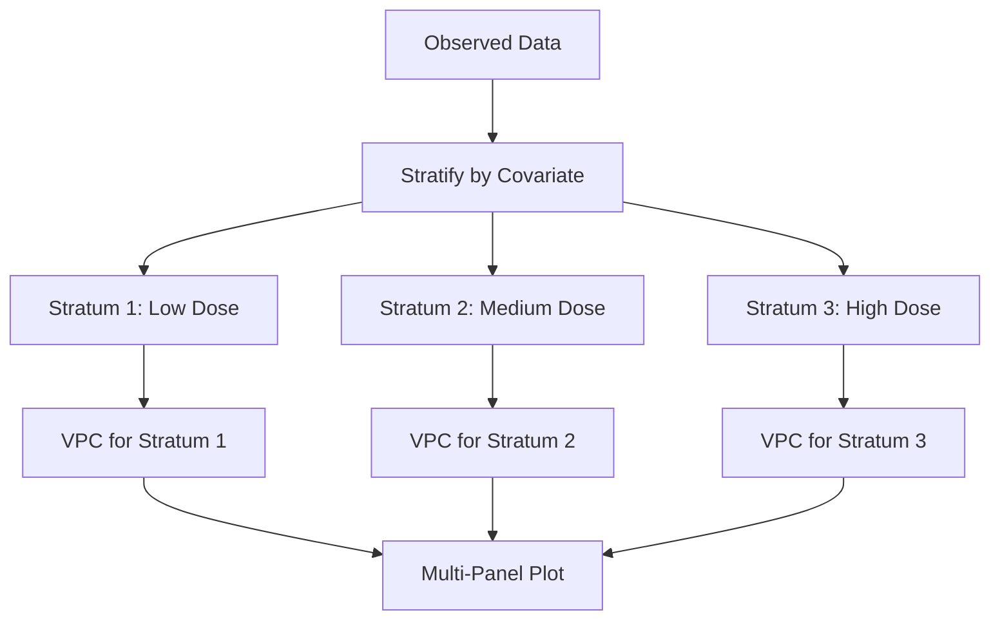

# Stratified VPC

Comprehensive guide to stratified Visual Predictive Checks for evaluating model performance across covariate subgroups.

---

## Overview

Stratified VPC computes separate VPCs for different subgroups of the population, enabling assessment of model performance across:

- Dose groups
- Formulations
- Disease severity
- Demographic subgroups
- Study sites or regions



---

## When to Stratify

### Use Stratified VPC When

| Scenario | Stratification Variable | Purpose |
|----------|------------------------|---------|
| Dose-finding study | Dose group | Assess dose-response |
| Multiple formulations | Formulation | Compare PK profiles |
| Renal impairment | eGFR category | Validate covariate model |
| Pediatric extension | Age group | Assess scaling |
| Global trial | Region | Detect ethnic differences |
| Disease progression | Disease stage | Validate disease model |

### Choosing Stratification Variables

```julia
# Good stratification choices:
# - Categorical or easily binned continuous
# - Sufficient observations per stratum (≥20 subjects)
# - Clinically meaningful groups

# Examples:
stratify_by = [:DOSE]           # Dose groups
stratify_by = [:FORM]           # Formulation
stratify_by = [:RENAL]          # Renal function category
stratify_by = [:DOSE, :FORM]    # Multiple variables
```

---

## StratifiedVPCResult Structure

```julia
struct StratifiedVPCResult
    results::Vector{VPCResult}        # One VPCResult per stratum
    stratify_by::Vector{Symbol}       # Stratification variables
    strata_names::Vector{String}      # Labels for each stratum
end
```

Each stratum contains a complete `VPCResult` with all percentile data.

---

## Computing Stratified VPC

### Basic Usage

```julia
using OpenPKPDCore

# Observed data with stratum information
observed = ObservedData(
    subject_ids = subject_ids,
    times = obs_times,
    dv = obs_dv,
    dvid = fill(:conc, length(obs_dv))
)

# Strata data: maps subject ID to stratum values
strata_data = Dict(
    "S1" => Dict(:DOSE => "100mg"),
    "S2" => Dict(:DOSE => "200mg"),
    "S3" => Dict(:DOSE => "100mg"),
    "S4" => Dict(:DOSE => "400mg"),
    # ...
)

# Population model
typical_params = OneCompOralParams(1.5, 5.0, 50.0)
omega = OmegaMatrix([0.09 0.0; 0.0 0.04])

doses = [DoseEvent(0.0, 100.0)]  # Reference dose
base_spec = ModelSpec(OneCompOral(), "stratified_model", typical_params, doses)

pop_spec = PopulationSpec(
    base_spec,
    n = length(unique(observed.subject_ids)),
    omega = omega,
    seed = 12345
)

# VPC configuration with stratification
config = VPCConfig(
    pi_levels = [0.05, 0.50, 0.95],
    stratify_by = [:DOSE],          # Stratification variable
    binning = QuantileBinning(6),
    n_simulations = 500,
    seed = 42
)

grid = SimGrid(0.0, 24.0, collect(0.0:0.5:24.0))
solver = SolverSpec(:Tsit5, 1e-10, 1e-12, 10_000_000)

# Compute stratified VPC
result = compute_stratified_vpc(
    observed, pop_spec, grid, solver;
    config = config,
    strata_data = strata_data
)
```

### Multiple Stratification Variables

```julia
# Stratify by dose AND formulation
strata_data = Dict(
    "S1" => Dict(:DOSE => "100mg", :FORM => "tablet"),
    "S2" => Dict(:DOSE => "100mg", :FORM => "capsule"),
    "S3" => Dict(:DOSE => "200mg", :FORM => "tablet"),
    "S4" => Dict(:DOSE => "200mg", :FORM => "capsule"),
    # ...
)

config = VPCConfig(
    stratify_by = [:DOSE, :FORM],   # Multiple variables
    # Creates strata: "100mg_tablet", "100mg_capsule", etc.
    n_simulations = 500
)

result = compute_stratified_vpc(
    observed, pop_spec, grid, solver;
    config = config,
    strata_data = strata_data
)
```

---

## Accessing Stratified Results

### Iterate Over Strata

```julia
# Access each stratum's VPC
for (i, vpc_result) in enumerate(result.results)
    stratum_name = result.strata_names[i]

    println("=== Stratum: $stratum_name ===")
    println("  Subjects: $(vpc_result.n_subjects_observed)")
    println("  Observations: $(vpc_result.n_observations_observed)")

    # Access percentile data
    times = bin_midpoints(vpc_result)
    obs_median = observed_percentile(vpc_result, 0.50)

    println("  Median at t=1: $(obs_median[1])")
end
```

### Extract Specific Stratum

```julia
# Get VPC for specific stratum
function get_stratum_vpc(result::StratifiedVPCResult, stratum_name::String)
    idx = findfirst(==(stratum_name), result.strata_names)
    return isnothing(idx) ? nothing : result.results[idx]
end

# Example
high_dose_vpc = get_stratum_vpc(result, "400mg")
if high_dose_vpc !== nothing
    println("High dose coverage: ", vpc_coverage(high_dose_vpc, 0.50))
end
```

### Compare Across Strata

```julia
# Compare model performance across strata
println("\nStratum Comparison:")
println("Stratum      | N Subj | Coverage P50 | Coverage P05 | Coverage P95")
println("-" ^ 70)

for (i, vpc_result) in enumerate(result.results)
    name = result.strata_names[i]
    n_subj = vpc_result.n_subjects_observed
    cov_50 = vpc_coverage(vpc_result, 0.50)
    cov_05 = vpc_coverage(vpc_result, 0.05)
    cov_95 = vpc_coverage(vpc_result, 0.95)

    @printf("%-12s | %6d | %11.1f%% | %11.1f%% | %11.1f%%\n",
            name, n_subj, cov_50*100, cov_05*100, cov_95*100)
end
```

---

## Stratification by Dose

### Dose Group Stratification

```julia
# Define dose groups
dose_groups = Dict(
    "S1" => Dict(:DOSE_GROUP => "Low"),      # 50-100 mg
    "S2" => Dict(:DOSE_GROUP => "Medium"),   # 150-250 mg
    "S3" => Dict(:DOSE_GROUP => "High"),     # 300-500 mg
    # ...
)

config = VPCConfig(
    stratify_by = [:DOSE_GROUP],
    pi_levels = [0.05, 0.50, 0.95],
    n_simulations = 500
)

# For dose-proportional drugs, consider pcVPC + stratification
# to separate dose-proportionality from IIV assessment
```

### Dose-Specific Simulations

```julia
# When doses differ between strata, provide dose-specific specs
dose_specs = Dict(
    "Low" => [DoseEvent(0.0, 75.0)],
    "Medium" => [DoseEvent(0.0, 200.0)],
    "High" => [DoseEvent(0.0, 400.0)]
)

# Or use subject-specific dosing
doses_per_subject = Dict(
    "S1" => [DoseEvent(0.0, 75.0)],
    "S2" => [DoseEvent(0.0, 200.0)],
    # ...
)
```

---

## Stratification by Covariate

### Continuous Covariate Binning

```julia
# Bin continuous covariates for stratification
function bin_covariate(value::Float64, breaks::Vector{Float64}, labels::Vector{String})
    for (i, break_point) in enumerate(breaks)
        if value < break_point
            return labels[i]
        end
    end
    return labels[end]
end

# Weight categories
wt_breaks = [60.0, 80.0, 100.0]
wt_labels = ["<60kg", "60-80kg", "80-100kg", ">100kg"]

strata_data = Dict(
    sid => Dict(:WT_CAT => bin_covariate(covariates[sid][:WT], wt_breaks, wt_labels))
    for sid in subject_ids
)

config = VPCConfig(stratify_by = [:WT_CAT])
```

### Renal Function Stratification

```julia
# Renal impairment categories (FDA guidance)
function classify_renal(egfr::Float64)
    if egfr >= 90
        return "Normal"
    elseif egfr >= 60
        return "Mild"
    elseif egfr >= 30
        return "Moderate"
    elseif egfr >= 15
        return "Severe"
    else
        return "ESRD"
    end
end

strata_data = Dict(
    sid => Dict(:RENAL => classify_renal(covariates[sid][:EGFR]))
    for sid in subject_ids
)

config = VPCConfig(
    stratify_by = [:RENAL],
    n_simulations = 500
)

# Assess if renal covariate model is adequate
result = compute_stratified_vpc(...)
```

---

## Interpretation Guide

### What Stratified VPC Shows

| Observation | Interpretation |
|-------------|----------------|
| All strata within CI | Model adequate across subgroups |
| One stratum outside CI | Potential subgroup-specific misspecification |
| Systematic pattern across strata | Covariate effect under/over-estimated |
| Different variability by stratum | Heteroscedastic IIV |

### Diagnostic Patterns

```
Pattern: High dose stratum shows over-prediction
Interpretation: Non-linear PK at high doses?
Action: Consider saturable clearance (Michaelis-Menten)

Pattern: Low weight stratum shows under-prediction
Interpretation: Weight covariate effect may be too strong
Action: Re-evaluate allometric scaling

Pattern: Elderly stratum shows increased variability
Interpretation: Age-related IIV increase?
Action: Consider age-dependent omega
```

---

## Stratified pcVPC

Combine stratification with prediction correction:

```julia
# Stratified pcVPC for variable-dose study with covariates
config = VPCConfig(
    prediction_corrected = true,
    stratify_by = [:DOSE_GROUP],
    pi_levels = [0.05, 0.50, 0.95],
    n_simulations = 500
)

# This:
# 1. Applies prediction correction within each stratum
# 2. Computes separate VPC per stratum
# 3. Allows assessment of IIV fit per dose group

result = compute_stratified_vpc(
    observed, pop_spec, grid, solver;
    config = config,
    strata_data = strata_data
)
```

---

## Complete Example

```julia
using OpenPKPDCore
using Random

# ================================================
# Stratified VPC Example: Dose-Finding Study
# ================================================

println("=== Stratified VPC by Dose Group ===\n")

# 1. Generate synthetic dose-finding study data
Random.seed!(789)

dose_levels = [50.0, 150.0, 300.0]
dose_labels = ["50mg", "150mg", "300mg"]
n_per_dose = 30
sampling_times = [0.5, 1.0, 2.0, 4.0, 8.0, 12.0, 24.0]

# True parameters
true_ka = 1.5
true_cl = 5.0
true_v = 50.0
omega_ka = 0.16
omega_cl = 0.09
omega_v = 0.04

subject_ids = String[]
obs_times = Float64[]
obs_dv = Float64[]
strata_data = Dict{String, Dict{Symbol, Any}}()

subject_idx = 1
for (dose, label) in zip(dose_levels, dose_labels)
    for _ in 1:n_per_dose
        sid = "S$subject_idx"

        # Store stratum info
        strata_data[sid] = Dict(:DOSE_GROUP => label)

        # Individual parameters
        ka_i = true_ka * exp(randn() * sqrt(omega_ka))
        cl_i = true_cl * exp(randn() * sqrt(omega_cl))
        v_i = true_v * exp(randn() * sqrt(omega_v))

        for t in sampling_times
            conc = dose * ka_i / (v_i * (ka_i - cl_i/v_i)) *
                   (exp(-cl_i/v_i * t) - exp(-ka_i * t))

            conc_obs = conc * (1 + 0.1 * randn())
            conc_obs = max(0.01, conc_obs)

            push!(subject_ids, sid)
            push!(obs_times, t)
            push!(obs_dv, conc_obs)
        end

        subject_idx += 1
    end
end

n_total = subject_idx - 1

# 2. Create observed data
observed = ObservedData(
    subject_ids = subject_ids,
    times = obs_times,
    dv = obs_dv,
    dvid = fill(:conc, length(obs_dv))
)

println("Dose-finding study:")
for (dose, label) in zip(dose_levels, dose_labels)
    n_in_group = count(v -> v[:DOSE_GROUP] == label, values(strata_data))
    println("  $label: $n_in_group subjects")
end
println("  Total: $n_total subjects, $(length(obs_dv)) observations")

# 3. Define population model
typical_params = OneCompOralParams(true_ka, true_cl, true_v)
omega = OmegaMatrix([
    omega_ka 0.0      0.0;
    0.0      omega_cl 0.0;
    0.0      0.0      omega_v
])

# Reference dose (will be adjusted per stratum)
doses = [DoseEvent(0.0, 150.0)]
base_spec = ModelSpec(OneCompOral(), "dose_finding", typical_params, doses)

pop_spec = PopulationSpec(
    base_spec,
    n = n_total,
    omega = omega,
    seed = 12345
)

grid = SimGrid(0.0, 24.0, collect(0.0:0.25:24.0))
solver = SolverSpec(:Tsit5, 1e-10, 1e-12, 10_000_000)

# 4. VPC configuration with stratification
config = VPCConfig(
    pi_levels = [0.05, 0.50, 0.95],
    stratify_by = [:DOSE_GROUP],
    binning = QuantileBinning(7),
    n_simulations = 500,
    n_bootstrap = 500,
    seed = 42
)

# 5. Compute stratified VPC
println("\nComputing stratified VPC...")
result = compute_stratified_vpc(
    observed, pop_spec, grid, solver;
    config = config,
    strata_data = strata_data
)

# 6. Report results
println("\n--- Stratified VPC Results ---")
println("Number of strata: $(length(result.results))")
println("Stratified by: $(result.stratify_by)")
println("Strata: $(result.strata_names)")

# 7. Detailed results per stratum
println("\n--- Per-Stratum Analysis ---")
for (i, vpc_result) in enumerate(result.results)
    stratum = result.strata_names[i]

    println("\n=== $stratum ===")
    println("  Subjects: $(vpc_result.n_subjects_observed)")
    println("  Observations: $(vpc_result.n_observations_observed)")
    println("  Bins: $(length(vpc_result.bins))")

    # Coverage
    cov_05 = vpc_coverage(vpc_result, 0.05)
    cov_50 = vpc_coverage(vpc_result, 0.50)
    cov_95 = vpc_coverage(vpc_result, 0.95)

    println("  Coverage:")
    println("    5th percentile: $(round(cov_05*100, digits=1))%")
    println("    50th percentile: $(round(cov_50*100, digits=1))%")
    println("    95th percentile: $(round(cov_95*100, digits=1))%")

    # Median comparison
    println("  Median at select bins:")
    for bin in vpc_result.bins[1:3:end]
        p50 = filter(p -> p.percentile == 0.50, bin.percentiles)[1]
        status = p50.simulated_lower <= p50.observed <= p50.simulated_upper ? "✓" : "✗"
        println("    t=$(round(bin.time_midpoint, digits=1)): obs=$(round(p50.observed, digits=2)), CI=[$(round(p50.simulated_lower, digits=2)), $(round(p50.simulated_upper, digits=2))] $status")
    end
end

# 8. Overall summary
println("\n--- Summary Across Strata ---")
println("Stratum  | Coverage P50 | Assessment")
println("-" ^ 50)

for (i, vpc_result) in enumerate(result.results)
    stratum = result.strata_names[i]
    cov_50 = vpc_coverage(vpc_result, 0.50)

    assessment = if cov_50 >= 0.90
        "Excellent"
    elseif cov_50 >= 0.80
        "Good"
    elseif cov_50 >= 0.70
        "Acceptable"
    else
        "Poor - investigate"
    end

    @printf("%-8s | %11.1f%% | %s\n", stratum, cov_50*100, assessment)
end

println("\n✓ Stratified VPC complete")
```

---

## Best Practices

### Sample Size Considerations

| Subjects per Stratum | Recommendation |
|---------------------|----------------|
| < 10 | Insufficient - combine strata |
| 10-20 | Marginal - interpret with caution |
| 20-50 | Acceptable for most analyses |
| > 50 | Good statistical power |

### Number of Strata

- **2-4 strata**: Ideal for clear interpretation
- **5-8 strata**: Acceptable with sufficient data
- **> 8 strata**: Consider combining or using different approach

### Avoiding Over-Stratification

```julia
# Bad: Too many strata
config = VPCConfig(stratify_by = [:DOSE, :FORM, :SEX, :RACE, :RENAL])
# Results in 2×3×2×4×4 = 192 potential strata!

# Good: Focus on key variables
config = VPCConfig(stratify_by = [:DOSE])  # Primary interest

# Or separate analyses
config_dose = VPCConfig(stratify_by = [:DOSE])
config_renal = VPCConfig(stratify_by = [:RENAL])
```

---

## See Also

- [Standard VPC](standard.md) - Basic VPC methodology
- [Prediction-Corrected VPC](pcvpc.md) - Variable dosing designs
- [VPC Index](index.md) - Overview
- [Python Stratified VPC](../../python/viz/vpc.md) - Visualization
